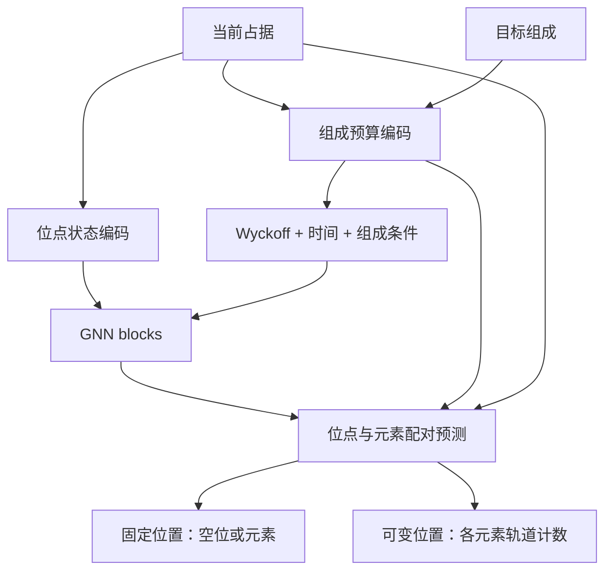

# CrystalGNN：面向 Wyckoff 模板生成的图网络

从 `models/pl_models/crystal_gnn.py` 的 `CrystalGNN.forward()` 开始阅读：
先编码当前占据和组成预算，再叠加 Wyckoff 特征与时间条件，经过图传播后输出两个分支的 logits。

| 文件（`models/pl_models/`） | 职责 |
| --- | --- |
| `crystal_gnn.py` | 组织主流程；编码占据、组成预算和 Wyckoff 条件；预测固定/可变位置的占据 |
| `composition_encoder.py` | 联合训练共享的静态组成编码，不读取当前噪声占据 |
| `time_embedding.py` | Fourier 与 DiffCSP 时间编码 |
| `gnn_block.py` | 条件归一化、attention/FFN 残差、旧 block 参数名转换 |
| `attention.py` | QKV、多头边注意力、消息聚合和输出投影 |



`_encode_budget()` 处理独立模型的组成编码；联合模型通过
`_encode_shared_budget()` 在已缓存的静态编码上添加当前分配量和残差。
`_encode_condition()` 组合逐节点条件，`_predict_occupations()` 负责元素配对和输出拼装。
输出元素掩码、损失及最终计数守恒解码由 flow 调用方处理。

组件拆分保留参数名称和初始化顺序，旧配置中的 `crystal_gnn.FlowTimeEncoder`、
`crystal_gnn.DiffCSPTimeEncoder` 导入路径仍可用。更早的注意力和条件调制参数名
继续由 `GnnBlock` 加载钩子转换。
配置为 `conf/model/decoder/crystal_gnn.yaml`。通过现有 decoder 接口接入
`DiscreteFlowModule`，需要从头训练新网络。

## 设计依据

图中的节点代表 Wyckoff 轨道类型，而不是带三维坐标的原子。因此网络利用
空间群、Wyckoff 对称性、重数和化学组成，不引入不存在的原子距离或键角。

| 改动 | 目的 |
| --- | --- |
| 元素 embedding 与向量计数 embedding 联合编码 | 避免先将每种轨道计数压缩成单个标量；显式表达元素与计数的关系 |
| Wren 的 444 维 `bra-alg-off` 描述符 | 补充可跨空间群共享的晶体学特征，与空间群、位置、自由度、重数 embedding 一起输入 |
| 各元素已分配原子数与剩余原子数 | 让各位点协调满足完整组成；按常规晶胞重数累计，保留负残差以识别过量占据 |
| 多头图注意力与重数关系偏置 | 按接收节点归一化消息；边特征包括重数比、最大公约数比例、自由度和自环标志 |
| 条件归一化、可学习残差缩放、dropout | 将时间和组成注入每层，稳定残差更新并提供可调正则化 |
| 跨元素共享计数预测头 | 针对每个位点—元素组合预测轨道计数，使较少见的正计数类别共享训练信号；仅计算组成中存在的元素 |

原子计数关系为：

```text
当前原子数[e] = Σ位点 multiplicity[位点] × 当前轨道计数[位点, e]
剩余原子数[e] = 目标原子数[e] − 当前原子数[e]
```

固定位置的轨道计数是元素 one-hot，空位为全零；可变位置使用当前 flow 状态的
元素计数向量。剩余原子数是软特征，不用它锁定或排除位点，因此仍可纠正当前
错误的占据。数据中的 `x_0_dof`、`x_inf_dof` 是状态来源，不依赖可能尚未更新的 `x`。

输出继续为 `(zero_logits, inf_logits)`。不在组成中的元素通道是占位值，
调用方必须像现有 `DiscreteFlowModule` 一样应用元素掩码；最终组成守恒由现有
解码器保证。Wren 特征来自项目已有的 `wyckoffflow/aviary` 依赖并保存进检查点。

节点重排等变性与原点变换等价性是不同的性质。本网络没有强制所有等价原点表示
输出相同概率；继续使用数据集的等价表示增强，并按 `scripts/eval_gwa.py`
相同口径评估等价模板命中。

## 启动训练

```bash
uv run python -m models.run model/decoder=crystal_gnn
```

时间编码配置位于 `conf/model/time/`，默认使用 `fourier.yaml`。
切换到 DiffCSP 正弦编码：

```bash
uv run python -m models.run model/decoder=crystal_gnn model/time=diffcsp
```

频率数量、频率范围或最大周期、时间缩放均在对应 YAML 中设置；例如
`model.decoder.time.time_scale=1.0`。时间编码的输出维度跟随 decoder 的
`hidden_dim`。默认 Fourier 使用 32 对 sin/cos 加 t、1−t，DiffCSP 使用 33 对
sin/cos；两者输入投影均为 66 维，便于保持参数量一致做对照。

默认 4 层、hidden=256、元素维度 128、8 个注意力头、dropout=0.1。
在默认 100 种元素、最大轨道计数 54 的配置下，可训练参数约 520 万，
原 `wyckoff_gnn` 约 1,677 万；主要节省来自跨元素共享输出头。
其余训练、损失、采样和验证配置继承现有默认值。旧 `gnn.py` 检查点不适用于
这个新架构；请启动独立训练目录，不要用旧检查点作为 `resume_from`。

对照旧网络时保持数据、种子、训练轮数、优化器、损失权重和采样预算一致：

```bash
uv run python -m models.run --multirun \
  model/decoder=wyckoff_gnn,crystal_gnn
```

新网络提供三个独立特征开关，便于逐项消融，例如：

```bash
uv run python -m models.run \
  model/decoder=crystal_gnn \
  model.decoder.use_composition_residual=false
```

另外两个开关是 `use_symmetry_features`、`use_edge_bias`。
关闭组成残差时仍保留目标组成与节点自身当前占据，只移除显式全局分配量和残差。
可通过 `model.decoder.dropout=0.0` 检查正则化的影响。
该参数作用于 FFN 隐藏激活、注意力与 FFN 的残差输出，以及三个占位预测头的
隐藏激活；特征编码器、注意力权重和最终 logits 不做 dropout。
FFN 隐藏激活与残差输出使用独立的 dropout；评估时均由 `model.eval()` 关闭。

`model.decoder.use_residual_scale=false` 可从头训练不含可学习残差缩放的对照。
关闭后 attention 和 FFN 分支直接加回主干，不创建缩放参数；默认仍启用，初始值为 0.1。

`model.decoder.use_condition_silu=true` 将 `adaLN_modulation` 配成
`nn.Sequential(nn.SiLU(), nn.Linear(hidden_dim, 4 * hidden_dim))`，保留 Linear
的零初始化和原来的残差缩放。该选项默认关闭，使用 Identity → Linear；适合作为独立消融。

## 如何判断效果

主要比较固定生成配置下验证集的 GWA@1、GWA@20（包含等价模板），并以
`best_gwa.ckpt` 为生成指标选模结果。辅助观察非空位点、计数 ≥ 2 类别准确率
和验证 CE。已有检查点诊断表明，CE 变差可以与 GWA 改善同时发生，因此不能
仅凭 CE 宣称新网络更好。

测试覆盖 230 个空间群、无固定位置的图、节点重排、批次间隔离、常规晶胞原子
计数、过量占据、时间端点、组成绝对数量、混合精度反向传播、采样与守恒解码、
检查点恢复及消融开关：

```bash
OMP_NUM_THREADS=2 MKL_NUM_THREADS=2 PYTHONPATH=. \
  uv run --no-sync pytest -q \
  tests/test_crystal_gnn.py tests/test_training_config.py tests/test_checkpoint.py
```

本次 CPU 验证共通过 21 项相关测试，包括 bfloat16 反向传播。在默认网络配置下，
用 32 个真实 MP20 训练材料做 20 步优化，固定噪声评估的 loss 从 3.5108 降至
1.5703；3 步 flow 后的 8 个解码样本均满足目标组成。记录保存在
`artifacts/2026-09-24_crystal_gnn/smoke.json`。这是小批次可训练性检查，
不是验证集性能对照；完整重训后的 GWA 提升幅度尚未验证。
