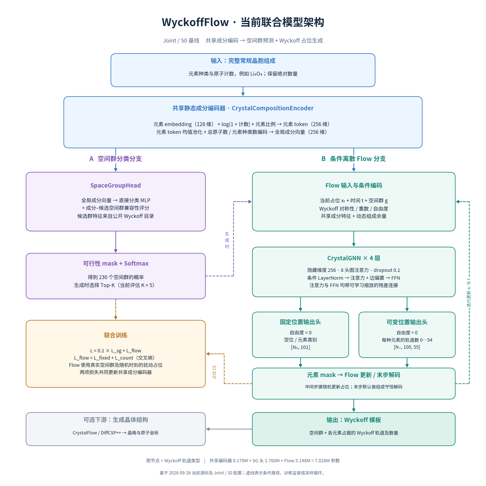

# 当前模型架构：Joint / S0

本图对应当前联合模型 `JointSpaceGroupWyckoffModule`，采用 2026-09-25 的
`joint_sg01_ln_dropout` 配置，也是 2026-09-26 容量实验中的 S0 基线。
仓库裸启动配置仍是独立 `discrete_flow`；使用 `experiment=joint` 才启用本图架构。



[SVG 矢量图](figures/current_model_architecture.svg)

## 核心结构

输入为完整常规晶胞的元素计数。共享编码器将 128 维元素 embedding、
log(1 + 元素计数) 和元素比例编码为 256 维元素 token。对存在元素取均值，
再加入总原子数与元素种类数的编码，得到 256 维全局成分向量。

空间群分支只读取静态成分特征与所有候选群的公开 Wyckoff 目录。
直接分类得分与成分–空间群兼容性得分相加，再进行组成可行性掩码和 Softmax。
实现输出 231 个通道，编号 0 始终屏蔽，因此有效类别是 230 个空间群。

Flow 分支读取当前占位、时间、空间群、Wyckoff 描述符与成分特征。
动态图余量为“目标元素原子数 − 当前已分配原子数”；已分配量按轨道重数加权。
余量是可正可负的软特征，最终精确计数约束由解码器执行。
图节点表示 Wyckoff 轨道类型，网络不输入三维原子坐标。

## 各模块维度

| 模块 | 当前基线配置 |
|---|---|
| 元素种类 | 100；另有空位通道 |
| 元素 embedding | 128 维 |
| 共享元素 token / 全局成分向量 | 256 维 |
| SG 直接分类 MLP | 256 → 512 → 512 → 512 → 231 |
| 候选群集合编码器 | Wyckoff 位置的重数、自由度、位置 embedding → token MLP → 均值池化；加入群编号 embedding 的映射，再经输出 MLP 得到 256 维群特征 |
| SG 兼容性 MLP | 拼接成分向量、群特征及二者逐元素乘积：768 → 256 → 256 → 256 → 1；各候选群共享 |
| SG 评分 MLP 隐藏层 | Linear → LayerNorm → SiLU → Dropout(0.1) |
| Wyckoff 对称性特征 | Wren 444 维描述符 → 256 维 |
| 时间编码 | t、1−t、32 组正弦 / 余弦特征 → 256 维 |
| CrystalGNN | 4 层，256 维，8 头，每头 32 维 |
| 每层注意力 | 条件 LayerNorm → 多头图注意力（7 维边特征产生偏置）→ 残差 |
| 每层 FFN | 条件 LayerNorm → 256 → 1024 → 256 → 残差 |
| 固定位置输出 | [N₀, 101]：空位或某种元素 |
| 可变位置输出 | [N₊, 100, 55]：每种元素的轨道数 0…54 |

`mlp_hidden_layers=3` 在当前 `get_mlp` 中对应 **3 个隐藏层**，不包括最终输出层。
历史运行记录中的值为 2，使用旧的“额外隐藏层数”语义；当前配置已改为实际层数。
SG 的 LayerNorm / dropout 设置仅用于直接分类和兼容性评分 MLP，
不自动用于共享组成编码器或候选群集合编码器。

Flow 的元素输出由“节点隐向量 + 动态元素 token + 位点–元素配对特征”构成查询。
固定位置分别预测空位和元素分数；可变位置使用跨元素共享的计数预测头。
N₀、N₊ 分别表示批次内自由度为 0 和大于 0 的节点数。
轨道计数不是原子数，原子数还需乘以该 Wyckoff 轨道的重数。

## 训练与生成

联合训练：L = 0.1 × L_sg + L_flow，其中 L_flow = L_fixed + L_count。
三项均为交叉熵；两项占位损失按每个图的有效预测变量数归一化。
Flow 训练使用真实空间群，在随机 t 将干净模板与 source 状态混合，预测干净占位。
默认 source 全为 0，即固定位置为空位、可变位置的轨道计数为 0。
默认两路损失均更新共享编码器，Flow 编码器梯度缩放系数为 1。

生成时先预测空间群，再为各选中群运行 Flow。默认从全零占位开始，
经元素掩码后的输出驱动随机离散更新，末步进行组成守恒解码。
当前联合验证设置为 Top-5 空间群、共 20 个模板、50 个 Flow 步；
可行群充足时每群 4 条轨迹。采样预算与步数是采样设置，不是网络结构。
Wyckoff 模板可再交给独立的 CrystalFlow / DiffCSP++ 模型生成晶体坐标与晶格。

## 参数量与依据

| 模块 | 可训练参数 |
|---|---:|
| 共享成分编码器 | 178,816 |
| 空间群头 | 1,700,440 |
| Flow 解码器 | 5,148,377 |
| 合计 | 7,027,633 |

参数量来自[现有容量审计](../artifacts/2026-09-26_capacity_experiment_design/parameter_counts.csv)的 S0 行。
当前独立 SG 容量实验使用图中共享编码器与 A 分支，改变 SG 头宽度 / 深度。

源码：[Joint](../models/pl_models/joint.py)、
[共享编码器与 CrystalGNN](../models/pl_models/crystal_gnn.py)、
[空间群头](../models/pl_models/spg_predictor.py)、
[离散 Flow](../models/pl_models/flow.py)。
配置：[joint.yaml](../conf/model/joint.yaml)、
[crystal_gnn.yaml](../conf/model/decoder/crystal_gnn.yaml)。

绘图脚本：[draw_architecture.py](../artifacts/2026-09-26_model_architecture/draw_architecture.py)。

```bash
MPLCONFIGDIR=/tmp/wyckoffflow-architecture-mpl UV_CACHE_DIR=/tmp/wyckoffflow-pl-uv-cache \
uv run --no-sync python artifacts/2026-09-26_model_architecture/draw_architecture.py
```
