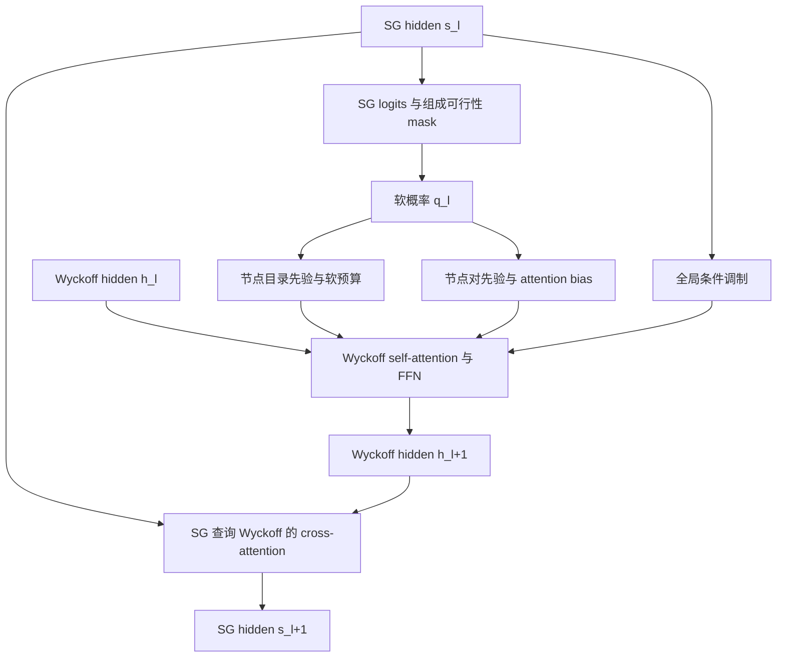

# SG–Wyckoff Coupling：理论与实现设计

本文将空间群（SG）与 Wyckoff 占位的双向耦合方案展开为可实施的架构设计。
目标是在每层网络内部完成 `SG → Wyckoff → SG`，在空间群尚不确定时也能更新
占位表示，全程不通过 `argmax(SG)` 选择图结构。

**文档状态：架构提案，尚未实现，也未经过实验验证。**
当前阶段先确定架构，本文仅整理设计，不修改模型或启动训练。
统一 count 表示、gate 初值、损失权重等仍是建议；实现前应确认文末的设计决策。

本文以 2026-10-08 检查到的仓库代码为依据。公式采用纯文本和 Unicode，
无需 MathJax 即可阅读；伪代码用于定义接口和计算顺序，不是可直接执行的实现。

## 1. 建模目标及适用范围

输入是完整常规晶胞的元素计数 `c`，输出是空间群 `G` 与 Wyckoff 占位模板 `n`：

```text
c → (G, n)

G ∈ {1, …, 230}
n[i, e] = Wyckoff 槽位 i 上元素 e 的轨道个数
```

这里的轨道个数不是原子数。假设某位置 multiplicity 为 4，
`n[i, Li] = 2` 表示该位置类型上有两个 Li 轨道，对应 8 个 Li 原子。
网络不直接生成晶格、原子坐标或自由 Wyckoff 参数；这些仍属于后续结构生成模型。

本方案研究的是：当前带噪占位能否帮助判断 SG，而 SG 的不确定性又能否反过来
改善占位预测。它允许网络学习这样的推理顺序：

```text
组成给出一组候选 SG
    ↓
候选 SG 的 Wyckoff 目录形成软节点与节点对先验
    ↓
结合当前占位，更新各槽位表示
    ↓
SG token 从更新后的槽位收集证据
    ↓
更新 SG 分布，进入下一层
```

需要区分三个概念：

| 概念 | 本方案的含义 |
| --- | --- |
| 表示耦合 | SG 和 Wyckoff hidden 在同一次 forward 内相互更新 |
| 多任务监督 | 同一次带噪输入同时监督 SG 分类和干净占位预测 |
| 联合概率模型 | 明确定义、归一化并采样 `p(G, n \| c)` |

前两项是第一版的明确目标。它们不会自动保证第三项：共享 hidden、两个交叉熵和
最终约束解码，不能直接解释为一个精确的联合概率分解。

## 2. 当前实现与改动边界

### 2.1 当前 CrystalGNN 的信息流

当前 [`CrystalGNN`](../models/pl_models/crystal_gnn.py) 使用真实或外部指定的 SG：

```text
指定 SG → 对应群的图、multiplicity、DOF、Wren 描述符
当前占位 + 组成 + 时间 + 上述条件 → 图注意力 → 固定／自由位置输出
```

[`JointSpaceGroupWyckoffModule`](../models/pl_models/joint.py) 共享静态组成编码器，
但 SG 分类分支与条件占位 flow 仍是两条分支。训练占位 flow 时使用真实 SG，
不是本文的层内双向耦合。

当前代码的具体依赖如下：

| 位置 | 使用的 SG 相关信息 | 未知 SG 模式应如何处理 |
| --- | --- | --- |
| 图构造 | 节点数量与固定／自由位置划分 | 固定使用 27 个槽位 |
| `_encode_condition()` | `sg_embedding(group)`、位置、DOF、multiplicity、Wren | 使用候选群表的软混合 |
| `occupation_counts()` | 真实 multiplicity 加权的原子分配量 | 使用当前 posterior 下的期望量 |
| `_encode_state()` | 当前轨道数乘真实 multiplicity | 初始化时仅编码轨道数，后续加入软原子量 |
| `_edge_features()` | 真实群的 multiplicity、gcd、DOF | 对所有候选群的 pair 特征求期望 |
| `_predict_occupations()` | 真实固定／自由分支、真实 multiplicity | 统一 count head 与软预算特征 |
| `sample_logits()` | 先按给定 SG 建图，再运行轨迹 | 通用槽位轨迹结束后才落实离散 SG |

只删除 `sg_embedding(group)` 不足以消除真实 SG 条件。节点数量、DOF、
图边数量、真实原子余量、分支张量形状都可能泄漏 SG。

### 2.2 信息使用边界

允许进入网络的内容：

- 输入组成、时间、当前带噪占位。
- 所有 230 个空间群的公开 Wyckoff 目录及 Wren 描述符。
- 只依赖组成和公开目录计算的 SG 可行性 mask。
- 固定的 27 个槽位编号。

真实 SG 仅用于：构造干净占位标签、计算监督损失、计算评估指标。
不允许用真实 SG 选择 attention mask、输入 DOF、multiplicity、节点数量或预算特征。

带噪占位本身会携带部分模板信息，这是去噪任务的合法输入。
在 `t = 0` 且 source 全为 0 时，占位不应携带任何样本的真实 SG 信息。

## 3. 通用状态空间

### 3.1 符号与张量

| 符号 | 形状 | 含义 |
| --- | --- | --- |
| `B` | 标量 | batch 中的晶体数 |
| `U` | 27 | 通用 Wyckoff 槽位数 |
| `C` | 基线为 100 | 元素种类数，不含 vacancy |
| `K` | 基线为 55 | count 类别数，计数范围 0…54 |
| `H` | 建议 256 | SG 和节点 hidden 维度 |
| `D` | 建议 128 | 元素 embedding 维度 |
| `Hₚ` | 建议 64 | 可选 pair 编码宽度 |
| `A` | 建议 8 | attention heads 数量 |
| `c` | `[B, C]` | 目标元素原子数 |
| `nₜ` | `[B, U, C]` | 当前带噪轨道计数，整型 |
| `sˡ` | `[B, H]` | 第 l 层 SG hidden |
| `hˡ` | `[B, U, H]` | 第 l 层 Wyckoff hidden |
| `qˡ` | `[B, 231]` | 对最终 SG 的预测概率，通道 0 屏蔽 |
| `count_logits` | `[B, U, C, K]` | 概念上的统一计数输出 |

仓库 `composition` 张量保留 `[B, C+1]`，第 0 列是 vacancy。
本文的 `c` 对应 `composition[:, 1:]`。

槽位编号遵循 `wyckoff_label_to_index[letter] - 1`，当前 27 槽位覆盖
`a…z,A`。应按字母显式映射，避免依赖字典顺序。
同字母在不同群中不代表同一种几何位置；槽位语义由候选群及其描述符决定。

### 3.2 将固定／自由位置统一成轨道计数

从选中的一个等价训练视图构造 `n₁`：

```text
先令所有 n₁[i, e] = 0

若真实群中的槽位 i 为固定位置：
    vacancy → 全 0
    元素 e  → n₁[i, e] = 1，其余元素为 0

若槽位 i 为自由位置：
    复制现有 x_inf_dof 对应的各元素轨道计数

若真实群中不存在槽位 i：
    保持全 0
```

固定位置的 one-hot 指的是元素维度上的占位，而 count 分类仍使用 `0…K−1`。
网络输入不携带“这个位置是真实群的固定位置”这样的标签。

例如，同一组通用计数可以在不同候选群下对应不同原子数：

```text
槽位 i：Li 轨道数 = 1
候选群 g₁：m[g₁, i] = 2 → 2 个 Li 原子
候选群 g₂：m[g₂, i] = 4 → 4 个 Li 原子
```

这正是需要 SG posterior 参与预算估计的原因。

### 3.3 合法模板与中间状态

给定一个确定的 SG，合法最终模板满足：

```text
不存在的槽位：n[i, e] = 0

固定槽位：Σe n[i, e] ≤ 1，且 n[i, e] ∈ {0, 1}

自由槽位：n[i, e] ∈ {0, …, K−1}

逐元素成分守恒：Σi m[G, i] · n[i, e] = c[e]
```

在软 SG 和带噪 flow 状态下，不强制这些条件同时成立。
尤其不能根据当前最大概率 SG，把其他群可能存在的槽位提前删掉。
第一版只硬屏蔽输入组成中不存在的元素；群相关的合法性约束留到最终解码。

当 `c[e] = 0` 时，对应通道始终固定为 count 0，不参与训练损失和随机更新。

## 4. 候选群静态目录

### 4.1 基础表

构造以下 buffer，包含编号 0 的占位行：

```text
exists[g, i]        [231, 27]     槽位是否存在
multiplicity[g, i]  [231, 27]     不存在时为 0
dof[g, i]           [231, 27]     不存在时填 0，但必须配合 exists 使用
symmetry[g, i, :]   [231, 27, S]  Wren 描述符
```

DOF 等于 0 既可能是固定位置，也可能是 padding，不能只凭 `dof == 0` 区分。
通道 0 不代表第 0 个物理空间群。第一版没有 SG mask-token flow，
因此这一行全为 0，分类时始终屏蔽，不为它分配概率。

表的来源：

- multiplicity、DOF、字母索引：[`lookup_tables.py`](../models/common/lookup_tables.py)。
- Wren：沿用 `CrystalGNN._symmetry_table()` 所用的本地描述符文件。
- 可行群：复用 [`formula_space_group_mask()`](../models/pl_models/count_conserving.py)。

目录表作为 buffer 保存到 checkpoint；由可训练 encoder 计算的表是中间结果，
训练时不能将其 detach 后长期缓存。

### 4.2 节点目录编码

建议先编码每个真实群的节点信息，再按 q 混合：

```text
R[g, i] = exists[g, i] · NodeCatalogEncoder(
    Wren[g, i],
    EmbMultiplicity(m[g, i]),
    EmbDOF(d[g, i]),
    log(1 + m[g, i])
)

rˡ[b, i] = Σg qˡ[b, g] · R[g, i]
vˡ[b, i] = Σg qˡ[b, g] · exists[g, i]
```

`vˡ` 是软存在概率，作为额外特征送给网络。
即使 encoder 带 bias，也要在编码后乘 `exists`，保证不存在的目录项输出为 0。
槽位位置 embedding 单独添加，不需要在每个群的表中重复存储。

选择“先编码后混合”的原因是：

```text
Σg q(g) · encoder(features[g])
```

明确是候选表示的加权平均，而非线性 encoder 作用于平均描述符时，通常不再等价。
它也避免对期望 DOF、期望 multiplicity 四舍五入后做 embedding lookup。

### 4.3 Pair 目录编码

对所有同时存在的槽位对 `(i, j)` 构造 `P[g, i, j]`，其中 i 为 query、j 为 key：

| 特征 | 定义或用途 |
| --- | --- |
| multiplicity 对数比 | `log(mᵢ / mⱼ)` |
| gcd / query multiplicity | `gcd(mᵢ, mⱼ) / mᵢ` |
| gcd / key multiplicity | `gcd(mᵢ, mⱼ) / mⱼ` |
| 同 multiplicity | `1[mᵢ = mⱼ]` |
| 两端 DOF | `dᵢ / 3`、`dⱼ / 3` |
| self pair | `1[i = j]` |

对不存在的 pair，以上特征置 0，不直接计算除以 0 或 `log(0)`。
定义 `a[g,i,j] = exists[g,i] · exists[g,j]`，并在 encoder 之后再次置零：

```text
E[g, i, j] = a[g, i, j] · PairEncoder(P[g, i, j])

pˡ[b, i, j] = Σg qˡ[b, g] · E[g, i, j]
wˡ[b, i, j] = Σg qˡ[b, g] · a[g, i, j]
```

`wˡ` 可与 p 拼接后产生 attention bias。
它是同一个 SG 下两槽位共同存在的概率，一般不等于 `vˡ[i] · vˡ[j]`。

第一版不声称存在额外的“Wyckoff pair compatibility 真值表”。
若要增加 Wren 相似度、联合可实现性等特征，必须先给出准确计算定义。
multiplicity、gcd 和 DOF 是目录关系，不等价于任意两个占位在几何上都可共存。

当前 sparse attention 使用 source/key → target/query 的方向。
从 `_edge_features()` 迁移时必须核对比值和 gcd 分母方向；不能直接将旧边向量
reshape 成 dense `[query, key]` 后假定语义一致。

### 4.4 Pair 的两种实现形式

第一版推荐“每层刷新 prior”，不维护跨层递归的独立 pair hidden：

```text
qˡ → pˡ → attention bias
qˡ⁺¹ → pˡ⁺¹ → 下一层 attention bias
```

如果 p 只进入线性 bias 投影，可利用线性关系：

```text
W(Σg q[g] E[g,i,j]) = Σg q[g] W(E[g,i,j])
```

先将各群 pair 编码为 `[231, 27, 27, A]` 的 head bias，再混合，
可以避免物化 `[B, 27, 27, Hₚ]`。该等价关系不适用于混合后的非线性 MLP。

完整的递归 pair 模型作为后续扩展：

```text
zˡ⁺¹ᵢⱼ = zˡᵢⱼ + γˡ · PairUpdate(zˡᵢⱼ, hˡ⁺¹ᵢ, hˡ⁺¹ⱼ, pˡᵢⱼ)
```

它才具有随当前占位更新的持久 pair state。第一版不包含 triangle update，
也不应因为存在 pair bias 就将其描述为完整的 AlphaFold2 式 pair trunk。

## 5. 初始化：避免依赖循环

### 5.1 静态组成特征

复用 [`CrystalCompositionEncoder`](../models/pl_models/composition_encoder.py)：

```text
element_embeddings  [C+1, D]
element_tokens      [B, C, H]
composition_pooled  [B, H]
```

这三个特征只依赖 c，同一次采样轨迹可以复用。
含动态余量的 budget token 不可跨 flow 步骤复用。

### 5.2 SG hidden

```text
u = composition_pooled + TimeEncoder(t)
s⁰ = SGInit(u)
```

第一版的 SG 初始化不读取真实 SG、不读取真实群加权的原子余量。
当前占位的信息在 coupling block 的 Wyckoff → SG attention 中进入 SG hidden。

### 5.3 节点 hidden

初始化只编码原始轨道数：

```text
token[i,e] = StateEncoder(
    element_embedding[e],
    count_embedding[nₜ[i,e]],
    log(1 + nₜ[i,e])
)

state[i] = 对 nₜ[i,e] > 0 的元素 token 求和 / sqrt(max(非零元素数, 1))

h⁰[i] = LayerNorm(
    state[i] + empty_state + position_embedding[i] + u
)
```

所有空槽位也有 position embedding 与组成条件，可以生成新占位。
初始化不计算 `nₜ × 真实 multiplicity`。
有了 `s⁰ → q⁰` 后，再计算第一层软预算，顺序不存在循环依赖。

## 6. 一个 SG–Wyckoff Coupling Block



### 6.1 SG posterior

对每层使用同一个 SG head，先保持参数量和语义简单：

```text
Lˡ = SGHead(LayerNorm(sˡ))
qˡ = softmax(mask_composition(Lˡ) / τ)
```

建议第一版 `τ = 1`。
mask 只依赖组成、最大轨道计数与公开目录，不依赖真实标签或当前 SG argmax。
通道 0 和不可行群置负无穷。
某条输入如果没有任何可行群，应在采样入口返回明确失败；不能对全负无穷求 softmax。

q 在训练中保持梯度，不做 detach、hard top-k、argmax 或 straight-through 替换。
“posterior”在这里指网络的条件概率预测，未经校准实验不能宣称其等于真实贝叶斯后验。

### 6.2 软预算和占位—目录一致性特征

最简单的期望 multiplicity 与原子量是：

```text
m̄ˡ[b,i] = Σg qˡ[b,g] · m[g,i]

Aˡ[b,e] = Σi m̄ˡ[b,i] · nₜ[b,i,e]
Δˡ[b,e] = c[b,e] − Aˡ[b,e]
```

这里对当前确定的 `nₜ`，`Aˡ` 恰好是候选 SG 下原子量的期望。
它可以是小数，且即使等于目标 c，也不意味着任一候选群都满足精确计数。
因此只将它用于 soft feature，不据此拒绝当前状态或宣称成分守恒。

沿用现有预算编码思路，使用：

```text
log(1 + Aˡ)
signed_log1p(Δˡ)
Δˡ / max(c, 1)
```

对于旧 head 中的 `c / m`、`c mod m`，不能直接改成对 `m̄` 取模。
余数是整数目录关系，应对每个有效目录项先计算，再混合：

```text
capacity_feature[i,e] = Σg q[g] · exists[g,i] · log(1 + c[e] / m[g,i])
remainder_feature[i,e] = Σg q[g] · exists[g,i] · (c[e] mod m[g,i]) / m[g,i]
```

实现时只在 `exists` 为真处计算除法与余数。
不得将未知 SG 的期望 multiplicity 取整后重新构图。

### 6.3 SG → Wyckoff：节点先验、全局调制、pair bias

定义每层 gate：

```text
αˡ = tanh(aˡ)
βˡ = tanh(bˡ)
```

先将节点目录与动态占位特征编码为 `δhᵢ`，形成：

```text
h̃ᵢ = hˡᵢ + αˡ · δhᵢ

conditionᵢ = static_conditionᵢ
             + αˡ · SGCondition(sˡ, rˡᵢ, vˡᵢ, budgetˡ)
```

用 condition 产生 AdaLN 的 scale 和 shift，再计算多头 self-attention：

```text
xᵢ = (1 + scaleᵢ) · LayerNorm(h̃ᵢ) + shiftᵢ
Qᵢ = WQ xᵢ，Kⱼ = WK xⱼ，Vⱼ = WV xⱼ

score[a,i,j] = dot(Q[a,i], K[a,j]) / sqrt(H/A)
               + αˡ · PairBias[a](pˡᵢⱼ, wˡᵢⱼ)

weight[a,i,:] = softmax(score[a,i,:])
message[a,i] = Σj weight[a,i,j] · V[a,j]

h_attn = h̃ + ρ_attn · Dropout(Out(message))
hˡ⁺¹ = h_attn + ρ_ffn · Dropout(FFN(AdaLN(h_attn, condition)))
```

建议沿用现有 block 的 FFN 宽度 `4H`、残差 dropout 与 `ρ` 残差缩放设置。
α 控制新增 SG 耦合，ρ 控制基础 attention/FFN 的残差幅度，两者含义不同。
这里 `static_conditionᵢ = position_embedding[i] + composition_pooled + TimeEncoder(t)`。

不额外添加对所有 key 都相同的标量 `b_G(s)`：

```text
softmax(score[i,:] + constant) = softmax(score[i,:])
```

这种常数偏置不会改变注意力权重。SG 的全局作用通过 AdaLN 或 Q/K 调制实现。
27 个槽位全部参与 attention，软存在概率作为特征，不转成离散节点 mask。

### 6.4 Wyckoff → SG：由 SG token 查询节点

更新后的节点既包含当前占位，也包含候选群目录交互信息。
SG token 对它们做 multi-head cross-attention：

```text
QG[a] = WQG[a] · LayerNorm(sˡ)
KW[a,i] = WKW[a] · LayerNorm(hˡ⁺¹ᵢ)
VW[a,i] = WVW[a] · LayerNorm(hˡ⁺¹ᵢ)

scoreG[a,i] = dot(QG[a], KW[a,i]) / sqrt(H/A)
weightG[a,:] = softmax(scoreG[a,:])
messageG[a] = Σi weightG[a,i] · VW[a,i]

s_attn = sˡ + βˡ · Dropout(SGOut(concat_heads(messageG)))
sˡ⁺¹ = s_attn + ρ_sg · Dropout(SGFFN(LayerNorm(s_attn)))
```

所有槽位都参与读取。空槽位也包含“当前没有占位”的证据，
不能仅保留当前非零槽位，否则全零 source 会没有可读取节点。

同一次 forward 的下一层用 `sˡ⁺¹` 重新预测 q，得到：

```text
q⁰ → h¹ → q¹ → h² → q² → … → hᴸ → qᴸ
```

### 6.5 第一版为何不加入 pair → SG pooling

若 pair 仅由 `qˡ` 和静态目录决定，对 pair 求均值再回传 SG，
主要是在回传 SG 自己的先验，并没有增加独立的占位证据。
第一版通过更新后的节点反馈即可。

只有当 pair state 已融合 `hᵢ、hⱼ、nₜ` 等当前状态后，
pair → SG pooling 才值得作为额外信息路径进行消融。
即便如此，也应测试它是否比 node cross-attention 带来实际收益。

### 6.6 Gate 与梯度

建议将 gate 参数初始化为使有效 gate 约等于 `0.01` 的小值。
这保证新增路径较弱，同时大部分耦合分支从第一步就有梯度。

严格零初始化时，若 `y = x + tanh(a) · fθ(x)`：

```text
a = 0 时：∂y/∂θ = 0
但一般 ∂y/∂a ≠ 0
```

gate 先学会打开，分支内部参数随后开始学习，是可用的稳定化策略。
不过它不能同时被描述为“第一步所有耦合参数都有非零梯度”。
现有 AdaLN 输出层也采用零初始化，需要同时检查两者对早期梯度的影响。

gate 只控制明确经过它的路径。若最终 count head 直接使用 q 导出的预算，
将 block 的 α 设为 0 并不等于完全删除 SG → Wyckoff 信息。
做方向消融时要同时关闭节点、pair、调制、预算和输出 head 中相应的 SG 依赖。

## 7. 输出 head 与模型接口

### 7.1 SG 输出

最后一层后输出 `SGHead(sᴸ)`，使用与中间层相同的组成 mask。
SG loss 监督最终输出。第一版不默认对每层 q 增加辅助交叉熵，
避免把中间表示过早限制为同一种预测。

### 7.2 统一 count head

对每个槽位和输入组成中的元素构造 query：

```text
query[i,e] = LayerNorm(
    hᴸ[i]
    + element_token[e]
    + DynamicBudgetEncoder(e, qᴸ, nₜ, c)
    + SlotElementEncoder(i, e, nₜ, qᴸ, c)
)

count_logits[i,e,:] = CountHead(query[i,e])
```

SlotElementEncoder 可使用当前轨道数、软分配原子量、软容量、软余数和预算残差。
其中每一项都必须按第 6.2 节定义，不能偷偷回到真实群的 metadata。

不再输出独立的 `zero_logits`。固定位置最终要选 vacancy 或单一元素，
在确定 SG 后由统一 count 分布转换得到，详见第 10 节。

概念上输出 `[B,27,C,K]`，实际应优先对组成中存在的元素打包计算：

```text
Q = Σb 27 × 该组成中存在的元素种类数
packed_count_logits: [Q, K]
对应索引: graph_id、slot_id、element_id
```

不存在元素的分布是确定的 count 0，不能用全零 logits 代替，否则 softmax 会变成均匀分布。
只有采样适配器确实需要完整张量时才展开。

### 7.3 建议接口

```python
# 不接收 ground_truth_sg、zero_dof、真实 multiplicities 或真实 edge_index。
output = decoder(
    counts_t,                 # [B, 27, C]
    composition,              # [B, C+1]
    time,                     # [B]
    composition_features,     # 可选，静态特征可缓存
    feasible_sg,              # [B, 231]，只依赖组成
)

output.sg_logits              # [B, 231]
output.count_logits           # dense 或带索引的 packed 输出
```

建议接口直接接收这些必要张量，而不是让 decoder 接收包含真实 SG metadata 的整个 batch。
标签和目标构造保留在训练 wrapper 中。

### 7.4 完整网络的计算顺序

以下伪代码连接前述各模块；`counts_t` 在一次 forward 内保持不变，
只有 hidden 在层间更新，离散占位由外层 flow sampler 更新：

```python
features = composition_features
time_hidden = time_encoder(time)
sg_hidden = sg_init(features.pooled + time_hidden)
node_hidden = initialize_nodes(counts_t, features, time_hidden)

# 原始目录固定，但这一步的 encoder 参数可训练，结果必须保留梯度。
node_table = encode_node_catalog(catalog)
pair_table = encode_pair_catalog(catalog)

for block in coupling_blocks:
    sg_logits = sg_head(sg_norm(sg_hidden)).masked_fill(~feasible_sg, -torch.inf)
    sg_prob = sg_logits.float().softmax(-1)
    node_prior = mix_node_catalog(sg_prob, node_table)
    pair_prior = mix_pair_catalog(sg_prob, pair_table)
    budget = soft_budget(counts_t, composition, sg_prob, catalog)

    node_hidden = block.update_wyckoff(
        node_hidden, sg_hidden, node_prior, pair_prior, budget, features, time_hidden
    )
    sg_hidden = block.update_sg(sg_hidden, node_hidden)

sg_logits = sg_head(sg_norm(sg_hidden)).masked_fill(~feasible_sg, -torch.inf)
final_prob = sg_logits.float().softmax(-1)
final_budget = soft_budget(counts_t, composition, final_prob, catalog)
count_logits = predict_counts(node_hidden, counts_t, features, final_budget)
return sg_logits, count_logits
```

如果最终 head 使用软容量／余数特征，`final_budget` 也包含相应的槽位—元素特征。
上述 mixing 可以用 einsum 完成；不要用 Python 循环对每个样本单独选择 SG。

## 8. 训练：统一计数离散 flow 与 SG 去噪分类

### 8.1 Flow 路径

第一版保留基线的全零 source：`n₀ = 0`。
对每个样本采样一个时间 `t ~ Uniform(0,1)`，再对每个有效槽位—元素变量采样：

```text
ξ[i,e] ~ Bernoulli(t)
nₜ[i,e] = ξ[i,e] · n₁[i,e] + (1 − ξ[i,e]) · n₀[i,e]
```

这是在两个离散状态之间选择，不是浮点插值。
同一图使用相同 t，各位置／元素使用独立 ξ；因此中间状态通常不满足精确成分约束。
不存在的真实槽位 target 为 0，source 也为 0，但它们仍保留为网络节点。

全零 source 中，0 同时表示“干净状态本来为 0”和“尚未显露的非零占位”，
不另设 MASK count 类别。这与当前 source 语义一致。

### 8.2 联合监督

同一次 forward 输出两项预测：

```text
qθ(G | nₜ, t, c)
pθ(n₁[i,e] | nₜ, t, c)
```

SG loss：

```text
L_SG = mean_b CE(sg_logits[b], G_true[b])
```

count loss 建议先延续现有代码的“每图求和，再按 batch 求均值”：

```text
E_b = {e : c[b,e] > 0}

L_W = mean_b Σi=1…27 Σe∈E_b CE(count_logits[b,i,e], n₁[b,i,e])

L = λ_SG · L_SG + λ_W · L_W
```

这里**包括真实群中不存在槽位的 count=0 标签**。
若用真实 `exists[G_true]` 把这些 loss 丢掉，网络就缺少对无效槽位占位的直接惩罚。
监督路径可以用真实标签，网络输入路径仍不得使用真实槽位 mask。

当前 [`flow_loss()`](../models/pl_models/flow.py) 实际按图累加损失后平均；
实验对照应以代码和保存的配置为准，不依赖旧文档中关于归一化的概述。
统一 27 槽位会增加受监督变量数，不能仅比较新旧 `val/loss` 的绝对数值。

建议同时记录每变量平均 CE，供观察 loss 尺度；不要未经标注就改变用于反向传播的归一化。
名义起点可设 `λ_W=1、λ_SG=1`，这只是待验证的新任务权重，不能称为已调优配置。
现有 joint 的 `sg_loss_weight=0.1` 可作为单独对照，不能直接据此认定适合新的 loss 尺度。

### 8.3 梯度如何形成双向耦合

count loss 回传 SG 分支：

```text
L_W → count head → hˡ⁺¹ → 节点／pair prior → qˡ → sˡ → SGHead
```

SG loss 回传 Wyckoff 分支：

```text
L_SG → sᴸ → SG cross-attention → hᴸ → Wyckoff attention／占位编码
```

两条路径不需要对离散采样状态求导。训练时 `nₜ` 的随机生成在计算图外完成，
可微性要求针对同一次网络 forward 内的 soft SG coupling。
最终 SG 选择和组合约束解码也不属于这个可微网络。

### 8.4 t=0 的 SG 预测与可选辅助监督

连续均匀采样几乎不会恰好抽到 `t=0`。
网络会接触接近 0 的时间与全零占位，但如果产品接口需要高质量的组成单独预测 SG，
应单独评估：

```text
predict_space_groups(c) = decoder(n₀=0, t=0, c).sg_logits.softmax(-1)
```

可选改进是给一部分 batch 显式设置 `t=0`，或者增加单独的 source SG loss。
这会改变训练目标或时间分布，应作为独立消融，不在第一版中隐式加入。

### 8.5 标签平滑、等价模板与 source 限制

指定基线 hparams 未保存 label smoothing；当前模块缺省值是 0，
因此新实验要显式写 `label_smoothing=0.0`，不能误继承当前配置中的 0.05。
如果以后对 masked SG logits 做平滑，需要只在允许类别内归一化，
不能把平滑质量分给负无穷的类别。

数据中多个等价 Wyckoff 视图，先选择一个完整一致的视图，再构造通用 n₁。
保持现有等价视图采样策略；不混用两个视图的不同槽位。
不默认把 loss 改成所有等价标签的最小 loss，这会是另一项训练目标变化。

全零 source 还有一个理论特征：在精确条件路径中，已经显露的非零计数就是终点计数，
其理想后验不再改变。有限模型和有限步采样仍可能改写它，但错误的早期占位可能造成自强化。
要改善这一点，可以另行研究 mask/random source 或其他路径；不能把它当作 coupling 自然解决的问题。

### 8.6 训练伪代码

```python
features = composition_encoder(batch.composition)
target_counts = to_universal_counts(batch)  # 只在目标构造处读取真实目录
time = torch.rand(batch_size, device=device)
present = batch.composition[:, 1:] > 0

keep_target = torch.rand_like(target_counts.float()) < time[:, None, None]
counts_t = torch.where(keep_target, target_counts, 0)

out = decoder(counts_t, batch.composition, time, features, feasible_sg)
sg_loss = cross_entropy(out.sg_logits, batch.space_group)
count_ce = count_cross_entropy(out.count_logits, target_counts)
count_loss = (count_ce * present[:, None, :]).sum((1, 2)).mean()
loss = sg_loss_weight * sg_loss + count_loss_weight * count_loss
```

packed logits 实现等价的求和，无需实际生成不存在元素的 count_ce。

## 9. 采样：保持通用图直到最终解码

### 9.1 第一版不额外建立 SG categorical flow

持久的随机 flow 状态只有 `nₜ`。
`sˡ、hˡ、qˡ` 都是在一次 forward 内生成的 hidden 或输出。

```text
flow 时间步 tₖ：
    用 c、tₖ 初始化 s⁰，用 nₜₖ 初始化 h⁰
    执行 L 层 coupling
    输出 q(G | nₜₖ,tₖ,c) 与终点 count logits
    用 count logits 更新 nₜ

flow 时间步 tₖ₊₁：
    重新初始化 hidden，再执行 L 层 coupling
```

第一版不把上一时间步 s 当作 RNN memory，也不将上一时间步 q 作为训练中未见过的额外输入。
SG 概率随时间变化，是因为当前占位和时间变化，而不是显式采样了 SGₜ。

### 9.2 离散更新及其理论含义

对变量 `j=(i,e)`，给定网络的干净 count 分布，非对角跃迁率可写为：

```text
uθ(nₜ[j] → k) = pθ(n₁[j]=k | nₜ,t,c) / (1 − t)，k ≠ nₜ[j]
```

采用一阶时间离散，设 `tₖ=k/T`：

```text
jump_probability = (1/T) / (1 − tₖ) = 1 / (T − k)

candidate[j] ~ Categorical(count_logits[j])
jump[j] ~ Bernoulli(jump_probability)
n_next[j] = candidate[j] if jump[j] else n_current[j]
```

当预测为精确条件后验、时间离散足够细时，这与所选条件路径的离散 flow 构造一致。
有限步、多变量同步更新及模型误差都会引入近似。
`greedy` 模式逐变量选最大概率类别，只是确定性推断变体，不是精确随机采样。

### 9.3 与当前 50 步采样预算一致的终点接口

建议沿用当前 `sample_logits()` 的习惯：共 T 次网络调用，
最后一次在 `t=(T−1)/T` 返回终点 logits，不再独立抽一次最终 count，
而是直接交给组合约束解码器。

```python
counts_t = zeros(B, 27, C)
features = composition_encoder(composition)
feasible_sg = formula_space_group_mask(composition, max_count)

for step in range(flow_steps):
    time = full(B, step / flow_steps)
    out = decoder(counts_t, composition, time, features, feasible_sg)
    if step == flow_steps - 1:
        break
    counts_t = categorical_update(
        counts_t, out.count_logits, jump_probability=1 / (flow_steps - step)
    )

return out.sg_logits, out.count_logits, trajectory_metadata
```

这时 SG 和 count logits 基于同一末步带噪状态。
称为“末步预测／终点提案”，不能说已经在真实 `t=1` 上计算了精确联合后验。
若增加一次最终占位抽样后再运行 `t=1` 的 SG 预测，需要单独统计额外网络调用，
且会遇到模型生成状态与干净训练状态的分布差异；第一版不默认这样做。

### 9.4 多候选策略

主评估建议每条通用 flow 轨迹产生一个候选：

1. 从末步 q 中采样一个可行 SG；greedy 模式取最大概率 SG。
2. 将统一 count logits 适配到该群。
3. 调用现有组成约束解码器，得到一个合法模板。

GWA@20 使用总共 20 条轨迹、20 个候选，重复模板也占预算。
这与旧 joint“先选若干群，再每群运行轨迹”的候选分配方式不同，要在报告中注明。

也可以从一条轨迹的 q 选多个 SG，并为每个群解码，但应作为另一种推断策略：
共享同一条轨迹会降低跨候选的独立性，不同群的 logits 也没有自动获得可比较的联合概率。
若采用该策略，仍限制总候选数，并记录轨迹数、网络调用数及群间预算分配。

## 10. 将统一 count logits 接入合法模板解码

### 10.1 只有此时才使用确定 SG 的 metadata

得到候选 `Ĝ` 后，根据其目录构建最终输出图：

- 移除不存在的槽位。
- 区分固定与自由位置。
- 填入确定的 multiplicity 和 DOF。
- 保留组成、`target_index`、`sampling_group` 等追踪字段。

这个操作发生在网络轨迹结束之后，不是每层 argmax 后重建图。
它与模型内部的可微 soft coupling 不冲突。

### 10.2 自由位置

对该群的自由位置，按字母取出统一 count logits：

```text
inf_logits[free_i, e, k] = count_logits[universal_i, e, k]
```

后续由现有 DP 约束 multiplicity 加权的元素总数。
不存在元素的通道固定为 0，正 count 类别屏蔽。

### 10.3 固定位置：从独立 count 分数构造单占位分数

不能直接把某个元素的 `logit(count=1)` 当作固定位置的元素得分，
因为“放入元素 e”还要求其他元素都为 0。

令 `ℓ[i,e,k] = log_softmax(count_logits[i,e,:])[k]`，只考虑输入存在的元素。
一个固定槽位的合法赋值分数应为：

```text
score_empty[i] = Σe ℓ[i,e,0]

score_element[i,e] = ℓ[i,e,1] + Σf≠e ℓ[i,f,0]
```

减去该槽位所有选项共有的 `score_empty` 后，可得到数值更简洁的 logits：

```text
zero_logits[i, vacancy] = 0
zero_logits[i, e] = ℓ[i,e,1] − ℓ[i,e,0]
                 = count_logits[i,e,1] − count_logits[i,e,0]
```

固定位置 count 大于 1 的状态不进入可选集合。
这种转换保留了统一独立 count 模型在合法固定位置赋值之间的相对分数，
之后可复用 [`decode_composition_logits()`](../models/pl_models/count_conserving.py)。

它不意味着固定位置的所有概率质量都很合理。如果模型大量预测 count>1，
投影仍会把它压回合法集合，因此需要单独报告投影前的非法概率／非法占位率。

例如只考虑 Li、O 两种元素，某槽位的边缘概率为：

```text
p_Li(0)=0.6，p_Li(1)=0.4
p_O(0)=0.8，p_O(1)=0.2

empty 分数对应概率：0.6 × 0.8 = 0.48
Li    分数对应概率：0.4 × 0.8 = 0.32
O     分数对应概率：0.6 × 0.2 = 0.12
```

其余 0.08 是两个元素同时占据该固定槽位的非法赋值。
合法三项归一化后约为 `0.5217、0.3478、0.1304`。
使用 `0、log(0.4/0.6)、log(0.2/0.8)` 做 softmax 得到相同结果，
而直接使用两项 `log p(1)` 无法保留这一关系。

### 10.4 解码器保证与不保证的内容

复用现有解码器可强制返回样本满足：

- 选中群的槽位存在性及固定位置单占位。
- 逐元素 multiplicity 加权的精确组成。
- 所设置的最大轨道计数。

这些是模板层面的约束，不保证最终坐标无碰撞、几何有效或热力学稳定。
现有 beam、Gumbel 扰动等选项也不应被描述为精确的联合后验采样器；
“精确成分约束”不等于“精确 MAP”或“精确概率采样”。

若需要跨 SG 排序，不能直接把不同群的 DP 分数当作已归一化的条件 log probability。
不同群的合法配置集合和归一化常数不同，删除的槽位、固定分支的公共常数也不同。
第一版按轨迹顺序报告候选；多群单轨迹模式可按 SG 概率排序，但要标注其是推断启发式。

## 11. 概率解释、可微性与局限

### 11.1 Soft catalog mixing 是表示近似

期望描述符定义良好，但非线性网络通常满足：

```text
Network(Σg q[g] · catalog[g]) ≠ Σg q[g] · Network(catalog[g])
```

因此第一版不是对 230 个完整条件模型的精确边缘化。
例如 q 在两个不相容目录间分散时，软 multiplicity、软 DOF 是用于推断的特征，
不会对应一个新的真实空间群。

### 11.2 联合终点相关性未被显式参数化

理想上需要：

```text
p(G, n | c) = p(G | c) · p(n | G, c)
```

第一版同时预测 `q(G | nₜ,t,c)` 与各变量的 count 边缘分布。
耦合 hidden 会让两项预测共享证据，但不保证从 q 选出的群与独立抽出的 count
天然构成一致的联合样本。最终投影可以修复合法性，却会改变原始生成分布。

这项限制需要通过 joint GWA、投影前合法率、投影修改量来衡量。
如果群间多峰冲突严重，再考虑候选群条件 count head、显式 SG 离散状态等扩展。

### 11.3 梯度和离散决策的边界

| 操作 | 是否可微 | 第一版的位置 |
| --- | --- | --- |
| SG softmax、目录混合、attention、count head | 是 | 训练网络内部 |
| 固定组成可行性 mask | 对模型参数是固定约束 | 每层 SG logits |
| 训练带噪 count 抽样 | 否，不要求求导 | 输入构造 |
| count trajectory 抽样 | 否，不要求求导 | 推断阶段 |
| 最终选 SG、DP／beam 解码 | 否 | 推断末端 |

“整个 coupling 可微”应限定为第一行，不能扩展成整个采样管线端到端可微。

### 11.4 SG 推断指标要区分输入信息量

`t=0` 的 SG 预测只读组成与空占位，可以与组成 SG 分类器比较。
随机 t 验证时，nₜ 来自真实模板，包含部分答案；该 SG 准确率属于去噪分类指标。
生成轨迹末步的 SG 准确率又使用模型自己生成的状态，属于完整生成指标。
三者应分别记录，不能用 teacher-corrupted 高 t 的结果代替组成预测能力。

## 12. 计算与内存实现建议

### 12.1 Dense attention

每图只有 27 个节点，dense `[B,A,27,27]` attention 比维护随群变化的 PyG 边表更直接。
每图拓扑固定，batch 之间不共享 attention。
softmax 和分数累积沿用当前实现的 float32 稳定性策略。

### 12.2 目录编码的复用

若目录 encoder 在各层共享，同一次 forward 内只计算一次 `R、E`，
每层仅使用不同 q 进行 einsum 或矩阵乘法。
训练跨 optimizer step 不缓存带旧参数计算出的 encoded table。
冻结权重的推断阶段可以缓存；验证后恢复训练时必须使缓存失效。

原始目录 buffer 不含梯度，可以长期缓存。
组成可行性 mask 在采样开始计算一次即可，避免每层调用 CPU feasibility 搜索。

### 12.3 避免不必要的大张量

以 B=256、U=27、Hₚ=64、C=100、K=55 为例，仅计张量本身：

| 张量 | 元素数 | float32 内存，约 |
| --- | --- | --- |
| `[231,27,27,64]` 编码 pair 表 | 10,777,536 | 43.1 MB |
| `[256,27,27,64]` soft pair hidden | 11,943,936 | 47.8 MB |
| `[256,27,100,55]` dense count logits | 38,016,000 | 152.1 MB |
| 平均 3 元素的 packed count logits | 1,140,480 | 4.6 MB |

这里是十进制 MB，不包含梯度、optimizer state 和其他激活，不能据此保证训练显存占用。
优先采用 packed 元素输出，以及第 4.4 节的 head-bias 线性混合。
不要生成 `[B,231,27,27,Hₚ]` 后再沿 SG 求和；使用 contraction 直接求加权结果。

### 12.4 共享与独立参数

第一版建议：

- 层间共享 SG head、静态 node/pair catalog encoder、组成编码器。
- 各层独立 Wyckoff self-attention、SG cross-attention、FFN、gate 与调制参数。
- 元素输出 head 跨槽位和元素共享。
- 时间编码沿用指定训练基线。

参数量和实际显存占用需要实现后测量，本文不预报未经测量的训练速度或精度收益。

## 13. 对仓库的实施拆分

为保留现有 checkpoint 和条件 flow，建议新增独立模型配置与实现，
而不是直接改变 `CrystalGNN.forward()` 的返回值。
下面文件名是提议，不表示已经创建。

| 拟新增模块 | 职责 |
| --- | --- |
| `models/pl_models/wyckoff_catalog.py` | 构建并保存全部 SG 的存在性、multiplicity、DOF、Wren、pair 表 |
| `models/pl_models/sg_wyckoff_block.py` | soft SG → 节点／pair 调制 → Wyckoff attention → SG cross-attention |
| `models/pl_models/coupled_crystal_gnn.py` | 初始化、目录混合、L 层 block、SG 与 count 输出 |
| `models/pl_models/coupled_flow.py` | 通用目标转换、腐蚀、联合 loss、通用轨迹采样 |
| `models/common/coupled_decoding.py` | 将统一 count logits 转换为候选群的固定／自由输出 |
| `conf/model/coupled.yaml` 等 | 新模型配置及独立实验入口 |
| `tests/test_sg_wyckoff_coupling.py` 等 | 防泄漏、梯度、训练／采样及解码验证 |

可复用的已有组件：组成与时间 encoder、MLP、可行群判断、count categorical 更新、
最终组成约束解码、Wyckoff 模板导出和等价 GWA 比较。
需要修改接口适配的组件：sampling dispatcher、checkpoint 配置入口、训练重建 callback。

当前重建 callback 会先评估 GT SG 条件 flow，再评估预测 SG。
新模型默认没有 GT SG 输入，不能未经适配就沿用这种调用顺序。
若增加“将 q 固定为真实群 one-hot”的诊断模式，它是 oracle 条件实验，
需要独立标注，不能混入未知 SG 的主指标。

建议按以下依赖顺序实施：

1. 建立目录和通用目标转换；完成全 SG 的槽位与固定／自由映射检查。
2. 实现统一 count 输出及最终解码适配；先证明表示能够往返到现有模板。
3. 实现单层 block；验证 q 的软混合与双向梯度。
4. 组合完整网络和训练 wrapper；完成小 batch 前向、反向和 optimizer 更新。
5. 实现完整未知 SG 采样轨迹，接上模板导出与等价 GWA 评估。
6. 核对配置与指定基线的差异，完成 checkpoint 保存／加载。
7. 通过必要检查后，再进行小规模过拟合与正式训练实验。

这套架构改变了输入／输出表示和参数形状，旧 CrystalGNN／joint checkpoint
不能直接当作新模型 `resume_from`。若以后部分迁移组成或时间 encoder，
应将其记为预训练初始化实验，而非与从头训练混为一谈。

## 14. 验证标准与实验设计

### 14.1 结构性验证

| 验证项 | 具体检查 |
| --- | --- |
| SG metadata 不泄漏 | 固定 c、nₜ、t，改变 batch 中仅用于标签的 SG／DOF／multiplicity，网络输出不变 |
| source 一致性 | 相同组成、全零 nₜ、相同 t，在 eval 模式产生相同输出，无论真实 SG 是什么 |
| 槽位稳定性 | 所有图始终 27 节点，batch 与单样本结果一致，样本顺序仅置换输出 |
| 目录正确性 | 按字母检查全部 230 群；不存在项编码后为 0；one-hot q 恢复对应目录 |
| 连续性 | 在两个 SG 的 q 间连续插值，节点／pair prior 连续变化，无 argmax 分支 |
| count → SG 梯度 | 单独反传 count loss，SG head 与所需 prior encoder 得到有限梯度 |
| SG → node 梯度 | 单独反传 SG loss，node encoder、self-attention 和 cross-attention 得到有限梯度 |
| 零 gate 特性 | 零初始化时按预期检查被 gate 阻断的分支，而非要求所有参数立即非零梯度 |
| 混合精度 | 有效 logits、loss、梯度有限，无 padding 除零或全屏蔽 softmax |
| 最终约束 | 解码后逐元素原子数精确匹配，固定位置无多占位，不存在槽位为空 |
| checkpoint 往返 | eval 预测保存／加载前后一致，目录 buffer 和配置完整保留 |

固定位置 count→类别转换应加入独立的小例子验证：
例如两个元素、一个固定位置，穷举 empty／元素 1／元素 2 的合法赋值，
检查适配后的相对分数与原 count 分布乘积一致。
约束解码在小状态空间中与穷举比较，避免只测试输出 shape。

### 14.2 指标

建议至少记录：

- 总 loss、原始 SG CE、原始 count CE、每变量 count CE。
- 非零 count 的准确率／召回率，避免大量 padding 0 使整体准确率虚高。
- 组成输入下的 SG Top-1／Top-5：显式 `t=0,n=0`。
- 不同 t 区间的去噪 SG Top-1／Top-5。
- 生成轨迹末步的 SG 命中率，以及投影前的群—占位合法率。
- 约束解码修改的槽位—元素数量、原子预算误差、解码失败率。
- joint GWA@1、GWA@20、候选重复率、每个目标实际生成候选数。
- 各层 q 的熵和 gate 值，用于判断是否过早坍缩或长期不使用耦合路径。

GWA 必须遵循 [`scripts/eval_gwa.py`](../scripts/eval_gwa.py)：
比较所有等价模板，不能因原点或等价 Wyckoff 标号变化误判不匹配。
SG head 预测准确并不自动意味着模板匹配率提高。

### 14.3 训练和评估基线

仓库指定训练基线为：

[`outputs/2026-09-24/09-56-08_discrete_flow/hparams.yaml`](../outputs/2026-09-24/09-56-08_discrete_flow/hparams.yaml)。

该基线是 GT SG 条件 flow，与未知 SG 任务的信息量不同，
应作为条件性能参考，不能直接把二者差异完全归因于 coupling。

| 设置 | 指定基线值 |
| --- | --- |
| 数据 | MP20 原有 train／val／test split，100 元素 |
| source | zeros |
| count 上限 | 54 |
| hidden / element dim | 256 / 128 |
| 层数 / heads / dropout | 4 / 8 / 0.1 |
| optimizer | AdamW，lr=0.0001，weight_decay=0.0 |
| batch size | train／val／test 均 256 |
| max epochs / seed | 1000 / 42 |
| 周期重建 | 每 100 epoch，20 个候选，50 次 flow 网络调用 |
| 重建 batch / CPU workers | 128 / 8 |
| 时间编码 | 未指定替代 time encoder，使用 FlowTimeEncoder 默认值 |
| 标签平滑 | 基线未保存该项；当前模块缺省 0.0 |

除了架构目标所必需的新表示、新 loss 和未知 SG 采样流程，其余配置保持一致。
特别是不能直接继承今天的全局默认配置，导致时间编码、label smoothing 或候选数悄然变化。
实现后保存 resolved config 和相对基线差异，准确记录任务本身无法保持相同的部分。

### 14.4 区分收益来源的消融顺序

| 实验 | 目的 |
| --- | --- |
| 现有 GT SG 条件 flow | 给定群情况下的模板预测参考 |
| 现有 composition SG + conditional flow／joint | 同样未知 SG 输入下的系统参考 |
| 通用 count 模型，禁用双向耦合 | 隔离表示变化和额外输出任务的影响 |
| 仅 SG → Wyckoff | 测试软目录条件是否有帮助 |
| 完整双向耦合，无 pair bias | 测试节点反馈是否有帮助 |
| 完整双向耦合，有 pair bias | 测试目录 pair 关系的增益 |
| 持久 pair state 或 pair → SG | 在第一版有效后再增加复杂度 |

相同的通用模型消融应保持 count loss、source、组成编码和采样预算一致。
方向消融必须切断该方向的所有路径，不能只将一个 gate 置 0。
参数量变化需要报告，必要时增加容量匹配对照。

先使用验证集选择设计，再在测试集做最终评估；不要按测试 GWA 反复选 gate 和损失权重。

## 15. 第一版建议与待确认决策

| 项目 | 建议 | 状态 |
| --- | --- | --- |
| 核心状态 | SG token + 27 通用槽位 | 与讨论方向一致 |
| 占位表示 | 统一元素轨道 count，替换固定／自由输入分支 | 待确认的主要变化 |
| SG 输出 | 231 通道，0 始终屏蔽 | 建议 |
| SG 时间状态 | 不额外采样 SGₜ，每次 forward 内推断终点 SG | 建议 |
| SG → Wyckoff | 节点先验 + pair bias + 全局调制 + 软预算 | 建议 |
| Wyckoff → SG | SG token 对更新节点做多头 cross-attention | 建议 |
| Pair state | 每层更新目录 prior，不做独立递归 pair hidden | 建议 |
| Gate | 有效初值约 0.01；零初始化作为对照 | 待验证 |
| Count loss | 27 槽位、存在元素，按图求和再平均 | 建议，需报告尺度变化 |
| SG loss 权重 | 名义起点 1；单独记录与现有 joint 的差异 | 待验证 |
| 最终模板 | 末步选群，再经统一 count→分支适配和成分约束解码 | 建议 |
| 主候选预算 | 20 条通用轨迹，每条一个候选 | 建议，与旧 joint 分配方式不同 |

需要先确认的是统一 count 表示，因为它决定训练目标、采样状态和最终解码接口。
其余模块可以在这套表示上逐项消融。
本文给出了可实施路径与必要验证标准，但未据此修改现有模型或启动实验。
